# Monokai Light

Modified version of the VS Code Monokai theme.
Somehow, the original Monokai theme is too dark for me, so here we are :smiley:

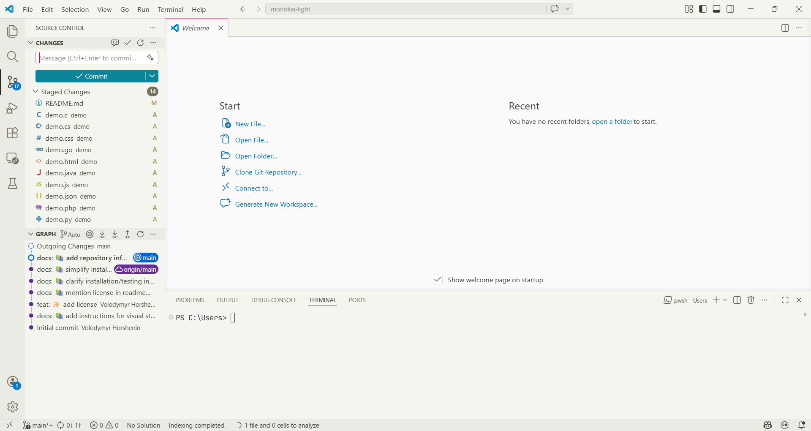

## 📸 Language Previews (Click to expand)

  
<b>🐍 Python</b>

   
  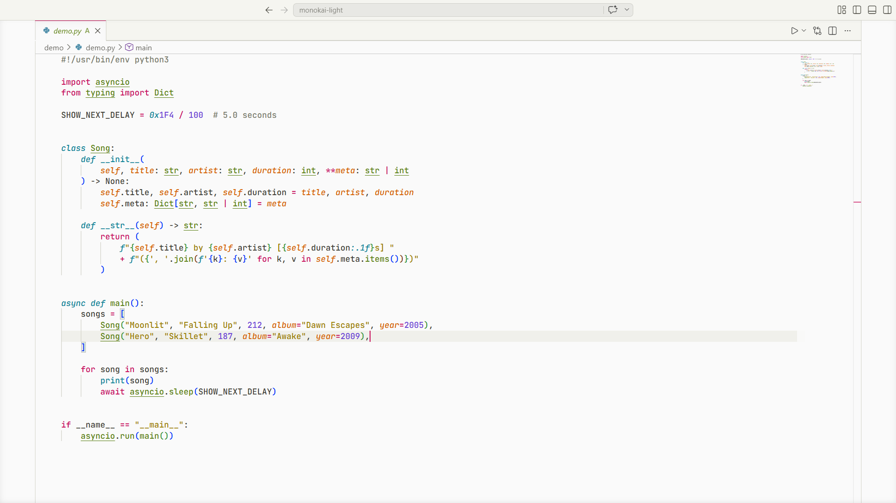

  
<b>🟨 JavaScript</b>

   
  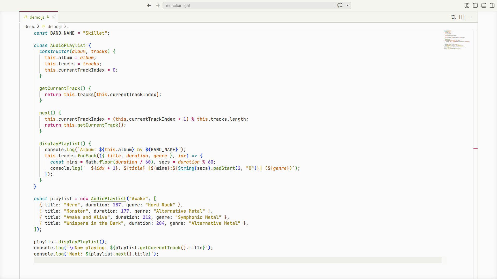

  
<b>🦀 Rust</b>

   
  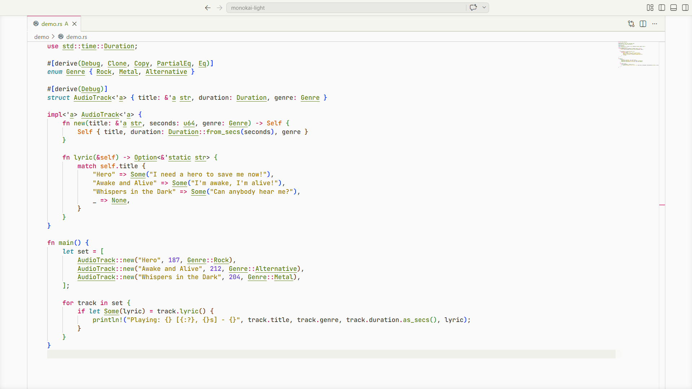

    
<b>📘 C#</b>

     
    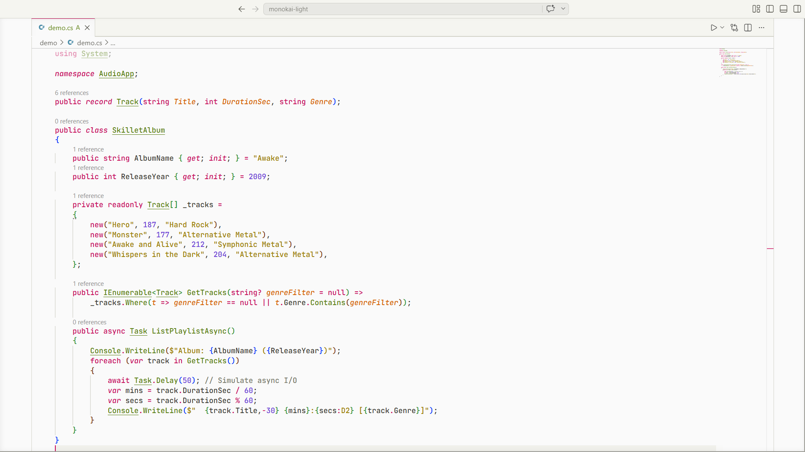

    
<b>©️ C</b>

     
    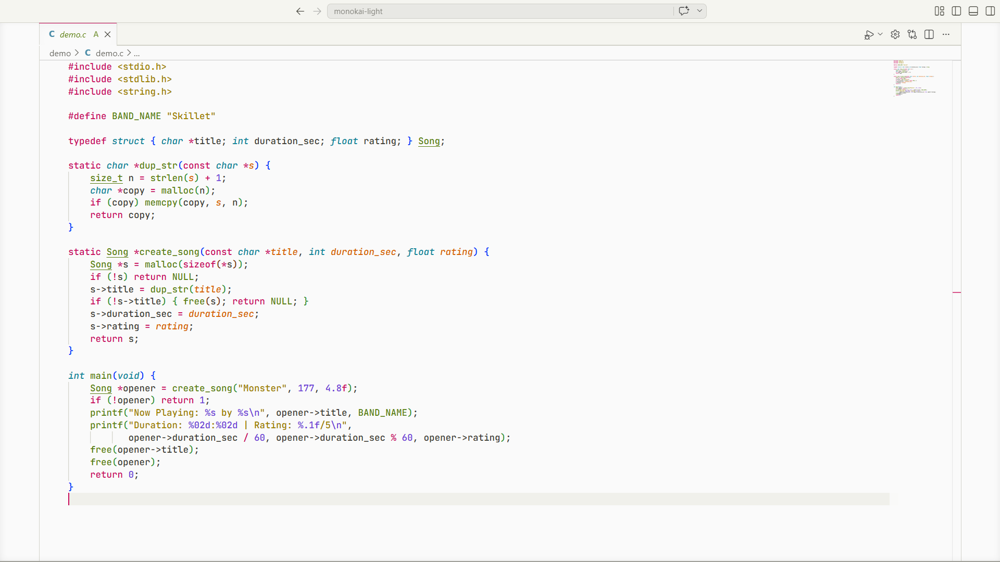

    
<b>🐹 Go</b>

     
    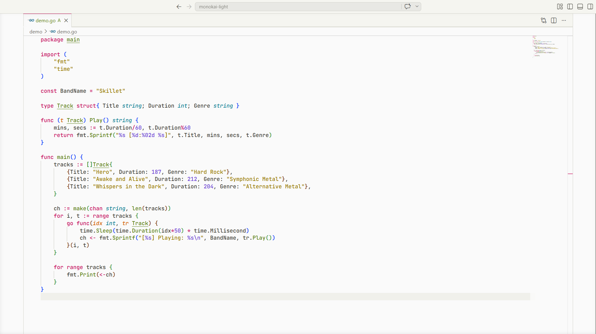

    
<b>🐘 PHP</b>

     
    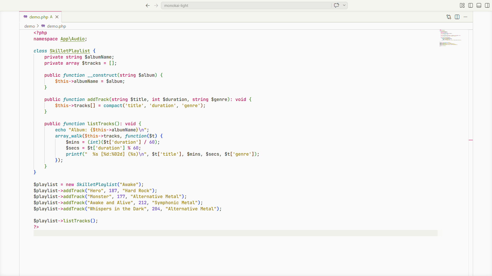

    
<b>☕ Java</b>

     
    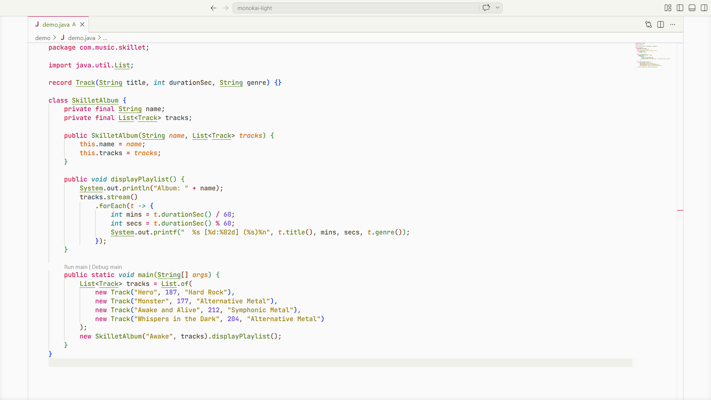

    
<b>📜 JSON</b>

     
    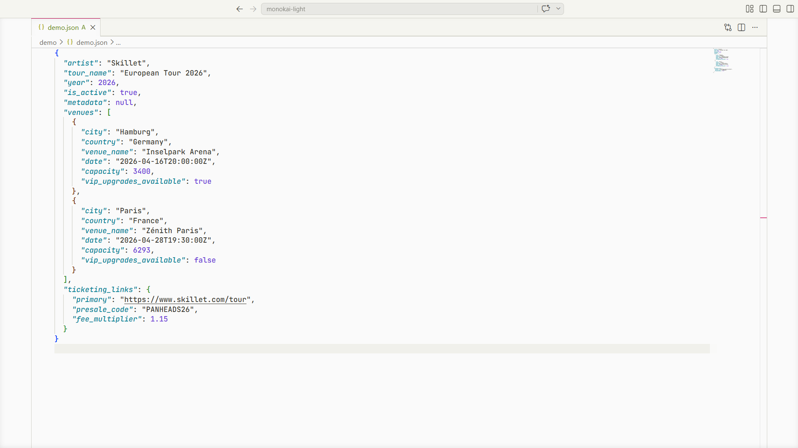

    
<b>📄 HTML</b>

     
    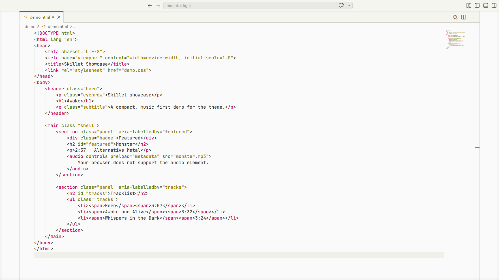

    
<b>🎨 CSS</b>

     
    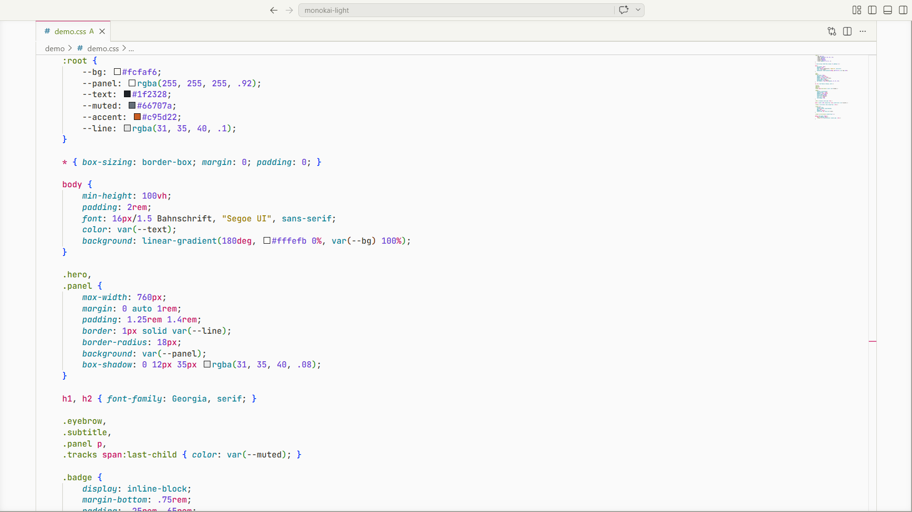

    
<b>🛠️ YAML</b>

     
    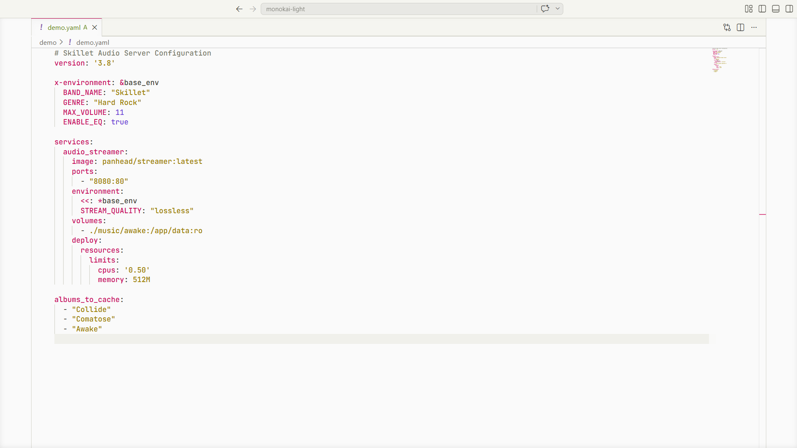

## Use in VS Code (Manual Installation)
1. Clone the repository to `%USERPROFILE%\.vscode\extensions`.
2. Delete the `extensions.json` file in the same folder if it exists (it will be regenerated by VS Code).
3. Restart VS Code.
4. Open the Command Palette and run `Preferences: Color Theme`.
5. Select `Monokai Light`.

## Use in VS Code (Local Development)
1. Clone the repository.
2. Open the extension folder in VS Code.
3. Press `F5` to launch an Extension Development Host window.
4. In the new window, open the Command Palette and run `Preferences: Color Theme`.
5. Select `Monokai Light`.

## Use in Visual Studio
1. Download the `monokai-light.json` file from the repository.
2. ***(Optional)*** Rename the file to your preference, but make sure to keep the `.json` extension.
3. Follow the instructions in the [Theme Converter for Visual Studio](https://github.com/microsoft/theme-converter-for-vs) repository to convert and apply the theme in Visual Studio.

## License
This project is licensed under the MIT License. See the [LICENSE](LICENSE) file for details.
